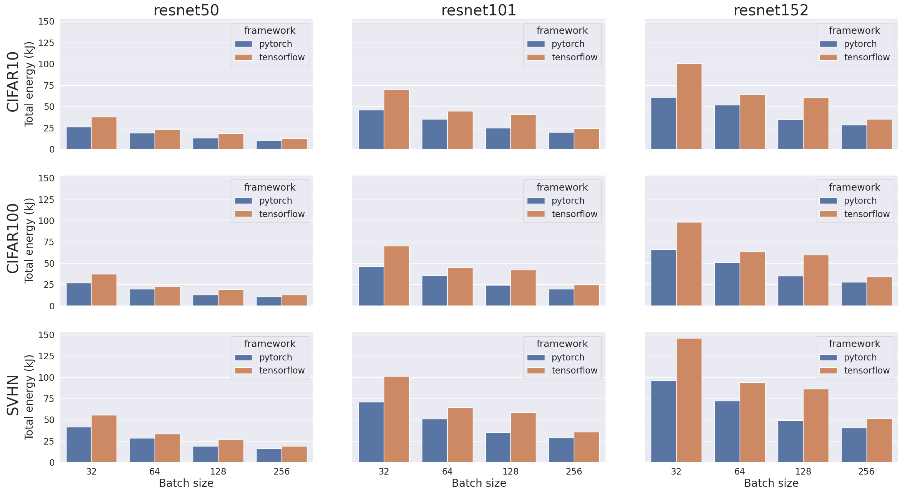

    

# Computer Systems Performance
### IT University of Copenhagen
Repository containing source code, data and results of miniproject 1 and 2 for Computer Systems Performance, course at IT University of Copenhagen.

## Authors
The authors of the projects are the following:
- *Ívar Óli Sigurðsson*, MSc Computer Science
- *Claudio Sotillos Peceroso*, MSc Computer Science
- *Jorge del Pozo Lerida*, MSc Data Science

# Mini Project 1 :floppy_disk:
## Project Description
This project focuses on data partitioning on Chip Multiprocessors, specifically using the methods of Independent Output and Concurrent Output. It also utilizes hash partitioning, specifically multiplicative hashing, to assign data points to specific partitions based on their hash values.

## Results

The results compared two methods, Independent Output and Concurrent Output, for different combinations of hash bits and threads.

Independent Output performed well for low hash bits but had decreased performance as hash bits increased. Increasing the number of threads improved performance.

Concurrent Output initially performed worse for low hash bits but improved as hash bits increased. The number of context switches was a key factor in its performance.

Independent Output outperformed Concurrent Output for low hash bits and few threads, but Concurrent Output scaled better for hash bits between 8 and 12. Both methods had decreased performance as the number of partitions increased due to dTLB load misses and the translation process.

# Mini Project 2 :rocket:

## Project Description
This project focuses on investigating the energy efficiency of PyTorch and TensorFlow frameworks using the ResNet architecture. It aims to optimize energy consumption in AI applications and contribute to building sustainable AI systems.

## Results

The results indicate that larger batch sizes reduce energy consumption and improve parallel processing efficiency. Models with more layers require more energy for training. TensorFlow consumes more energy than PyTorch, but PyTorch demonstrates faster learning and more efficient GPU usage. Further optimization is needed for better accuracy. Overall, PyTorch shows faster and more efficient learning compared to TensorFlow.
